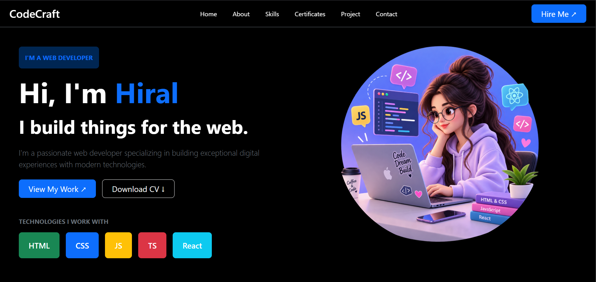
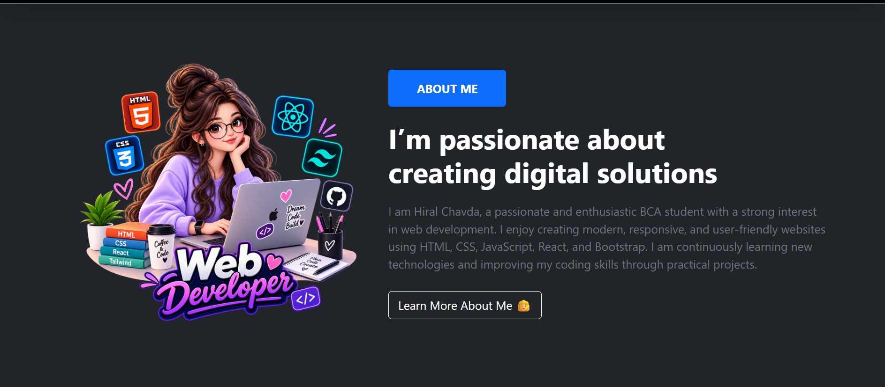
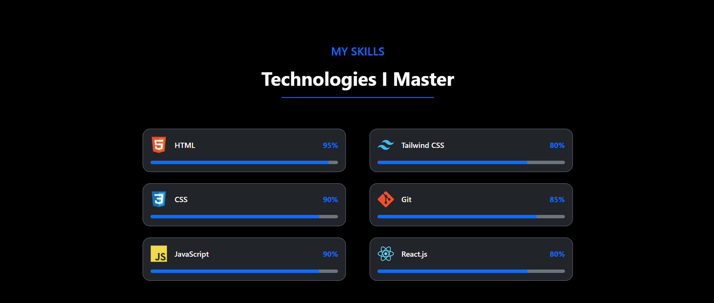
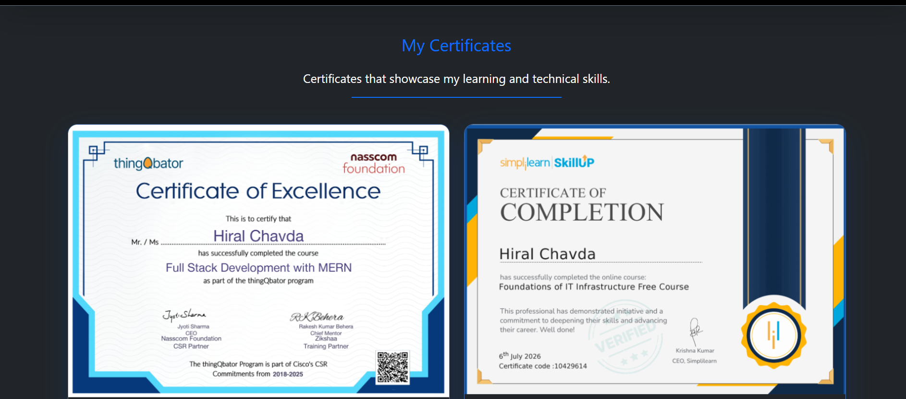
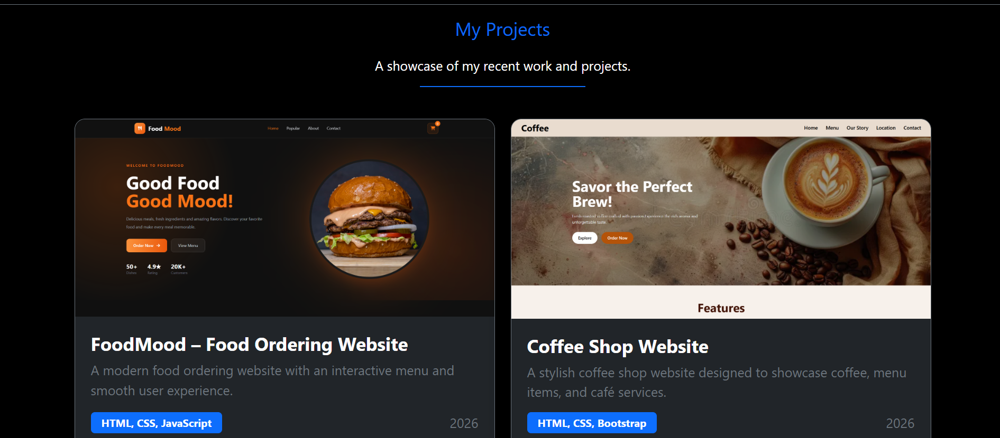

# 🚀 CodeCraft - Personal Portfolio

A modern and responsive personal portfolio website built using React.js and Bootstrap.

## 👩‍💻About

CodeCraft is my personal portfolio website where I showcase my skills, certificates, and projects as a web developer.

## 🛠️ Technologies Used

- HTML
- CSS
- JavaScript
- React.js
- Bootstrap

## ✨ Features

- 📱 Responsive Navigation Bar
- 🏠 Home Section
- 👩 About Me Section
- 💻 Skills Section
- 📜 Certificates Section
- 🚀 Projects Section
- 📩 Contact Section
- ✨ Hover Effects
- 📱 Responsive Design

## 💻 Skills

- 🟧 HTML - 95%
- 🟦 CSS - 90%
- 🟨 JavaScript - 90%
- ⚛️ React.js - 80%
- 🌊 Tailwind CSS - 80%
- 🔧 Git - 85%

## 📜 Certificates

### 🏆Full Stack Development with MERN

### 🏆Foundations of IT Infrastructure

## 📁Projects

### 1. 🍔FoodMood - Food Ordering Website

### 2. ☕Coffee Shop Website

### 3. 🏛️Architecture Website

### 4. 📦Product CRUD Application

### 5. 🚗Car Collection Website

### 6. 🌥️WeatherInfo Website

## 📸ScreenShot

